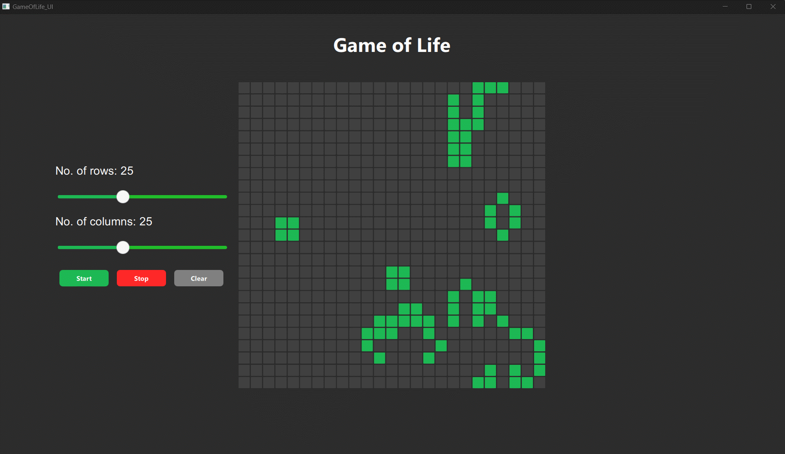

# GameOfLife_QT
 Conways Gameof life implementation using QT
# Game of Life

This project is an interactive implementation of Conway's Game of Life, built using Qt. It provides a visually appealing interface where users can configure the grid size, start, stop, and clear the simulation. The implementation ensures smooth animations and an intuitive design.

## Features
- Adjustable grid size (number of rows and columns).
- Start, stop, and reset the simulation using interactive buttons.
- Click on grid cells to toggle their state (alive or dead).
- Wrapping of cells for continuous simulation at the edges of the grid.

## Build Instructions
1. Open the project in **Qt Creator**.
2. Ensure all necessary dependencies for Qt Quick and Qt Controls are installed.
3. Compile and run the project.
   - The UI was designed using Qt Designer.

## Controls
- **Number of Rows/Columns**: Use sliders to adjust the grid size dynamically.
- **Start**: Begin the simulation.
- **Stop**: Pause the simulation.
- **Clear**: Reset the grid to its initial state.

